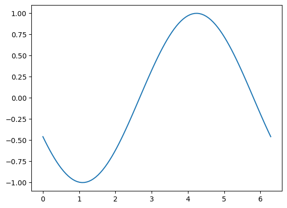
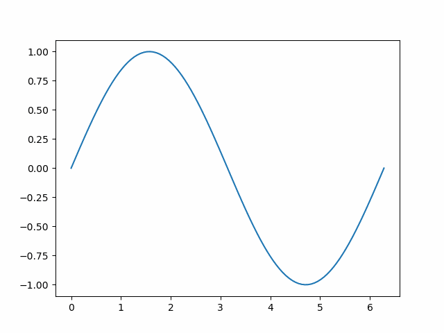

## Hi

# Blog Post: Dynamic Data Analysis

This notebook demonstrates:
- Creating a table in Python
- Making a dynamic plot
- Adding a hyperlink programmatically

Let's explore these features!


```python
import pandas as pd

# Data for the table
data = {
    "Name": ["Alice", "Bob", "Charlie"],
    "Age": [25, 30, 35],
    "Profession": ["Data Analyst", "Developer", "Designer"]
}

# Create a DataFrame
df = pd.DataFrame(data)

# Display as Markdown
from tabulate import tabulate
print(tabulate(df, headers='keys', tablefmt='pipe', showindex=False))
```

    | Name    |   Age | Profession   |
    |:--------|------:|:-------------|
    | Alice   |    25 | Data Analyst |
    | Bob     |    30 | Developer    |
    | Charlie |    35 | Designer     |


```python
import numpy as np
import matplotlib.pyplot as plt
from matplotlib.animation import FuncAnimation, PillowWriter

# Create figure and axis
fig, ax = plt.subplots()
x = np.linspace(0, 2 * np.pi, 100)
line, = ax.plot(x, np.sin(x))

# Function to update the plot
def update(frame):
    line.set_ydata(np.sin(x + frame / 10.0))  # Shift the sine wave
    return line,

# Create the animation
ani = FuncAnimation(fig, update, frames=100, interval=50)

# Save the animation as a GIF
gif_path = "dynamic_plot.gif"
ani.save(gif_path, writer=PillowWriter(fps=20))

plt.show()

print(f"GIF saved at {gif_path}")
```

    /opt/anaconda3/lib/python3.11/site-packages/matplotlib/animation.py:892: UserWarning: Animation was deleted without rendering anything. This is most likely not intended. To prevent deletion, assign the Animation to a variable, e.g. `anim`, that exists until you output the Animation using `plt.show()` or `anim.save()`.
      warnings.warn(


    

    


    GIF saved at dynamic_plot.gif


## Dynamic Plot Example

The plot below dynamically demonstrates an oscillating sine wave:


