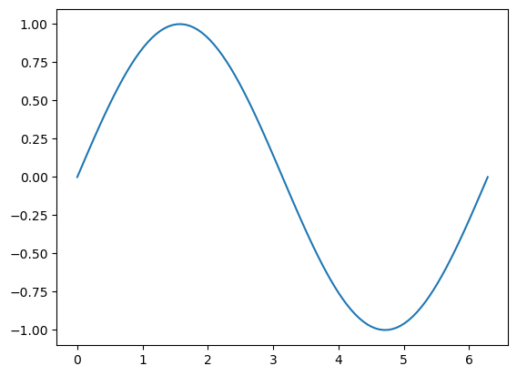

## Hi


```python
a=1
b=2
c=a+b
print(c)
```

    3


```python
import numpy as np
import matplotlib.pyplot as plt
import matplotlib.animation as animation

# Create figure and axis
fig, ax = plt.subplots()

# Generate data
x = np.linspace(0, 2 * np.pi, 100)
line, = ax.plot(x, np.sin(x))

def update(frame):
    line.set_ydata(np.sin(x + frame / 10.0))  # Update y-data
    return line,

ani = animation.FuncAnimation(fig, update, frames=100, interval=50, blit=True)
plt.show()
```


    

    


```python

```
